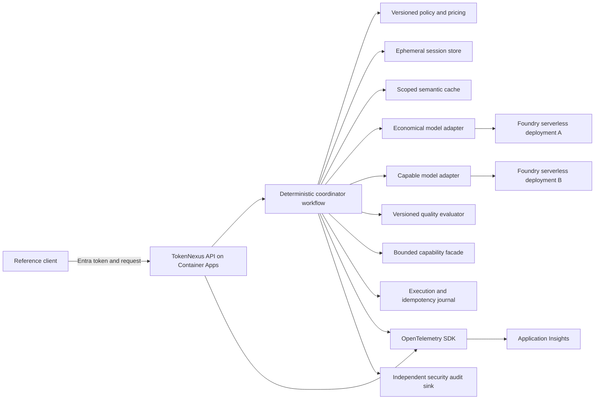
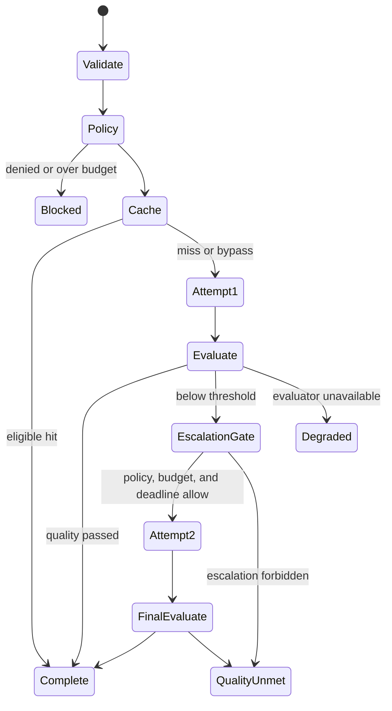

<!-- markdownlint-disable-file -->
# Task Research: TokenNexus-AI-Framework Implementation

Research technical approaches for implementing the TokenNexus-AI-Framework economics control plane described in docs/prds/tokennexus-ai-framework-prd.md.

## Task Implementation Requests

* Define router-to-specialist agent handoff patterns
* Compare session-level and persistent conversation memory
* Evaluate Azure AI Foundry deployment options
* Define OpenTelemetry observability patterns for agent systems

## Scope and Success Criteria

* Scope: Architecture and implementation guidance for the MVP control plane, including orchestration, memory, Azure deployment, and telemetry. Detailed application implementation and infrastructure provisioning are excluded.
* Assumptions: The PRD remains authoritative; Azure is the target platform; two model tiers and deterministic substitutes are required; protected tools and raw-content minimization are mandatory; production model, region, evaluator, and policy values remain unresolved; provisional candidates and pilot calibration defaults are selected below.
* Success Criteria:
  * Findings are supported by workspace evidence and authoritative external sources.
  * Alternatives and trade-offs are evaluated for each focus area.
  * One coherent implementation approach is selected.
  * Risks and actionable implementation steps map back to PRD requirements.

## Executive Recommendation

Implement TokenNexus as an application-owned, deterministic control plane. Use a Microsoft Agent Framework custom workflow or equivalent explicit state machine for bounded specialist delegation, but retain policy, budget, authorization, quality, escalation, and final-outcome authority in deterministic coordinator code.

Host the stateless API on Azure Container Apps and invoke two Microsoft Foundry serverless model deployments through provider-neutral `economical` and `capable` aliases. Provisionally benchmark `gpt-5.4-mini` and `gpt-5.4` as a same-family baseline, with `gpt-4.1-mini` and `gpt-4.1` as mandatory challengers when eligible. This is not a final availability or procurement decision. Keep request state in process, minimal non-sensitive recovery state in a short-lived application store, and semantic cache data in a separate scoped store. Disable provider-managed conversation storage for the MVP.

Instrument the request with OpenTelemetry and export directly to an environment-specific Application Insights resource. Use one product request span, standard GenAI spans for model and tool calls, TokenNexus spans for policy, cache, evaluation, escalation, and authorization, and span links for asynchronous handoffs or retries. Keep a durable execution journal and security audit records independent of sampled telemetry.

Adopt JSON Schema Draft 2020-12, Semantic Versioning, RFC 8785 canonical request fingerprints, UUIDv7 identifiers, canonical decimal strings, RFC 3339 UTC timestamps, and a closed dotted public reason-code registry. Put an application-owned capability facade between every specialist and protected tool. Grants are signed or opaque server-side authorization artifacts, never bearer credentials.

Use the versioned `pilot-1` policy profile for fixtures and controlled MVP evaluation: deterministic quality checks plus a versioned 1-5 judge rubric with provisional threshold 4, semantic-cache distance `0.05` and TTL 60 seconds, 8,192 input and 1,024 output tokens per attempt, 30-minute inactivity and 8-hour absolute session limits, one centralized transient retry, and one bounded tool call per attempt. These numerical values are calibration inputs, not production service levels.

This architecture is the best fit for the PRD because it preserves deterministic acceptance testing, lowest-cost-first execution, one-step escalation, server-side authorization, raw-content minimization, and complete decision evidence.

## Architecture Decision Summary

| Area | Selected approach | Rejected or deferred approach | Primary reason |
|------|-------------------|-------------------------------|----------------|
| Agent handoff | Coordinator-owned typed workflow with one bounded specialist adapter | Native handoff mesh or group chat | Conversational ownership transfer distributes policy and budget authority |
| Conversation memory | Request-scoped state plus short-lived structured session state | Durable transcripts, persistent profiles, provider-managed threads | Unnecessary retention, coupling, injection, and deletion risk |
| Semantic reuse | Separate scoped semantic cache | Treating cache as conversation memory | Different purpose, access, retention, and invalidation semantics |
| Control-plane hosting | Azure Container Apps | Foundry prompt agent or AKS | Stable application contract with managed operations and lower burden |
| Model serving | Two Foundry serverless deployments behind aliases | Managed compute by default | Faster MVP, consumption pricing, and no GPU operations |
| Candidate models | `gpt-5.4-mini` and `gpt-5.4` provisional baseline | Silent substitution or catalog-only selection | Same-family comparison reduces adapter variance; live gates remain mandatory |
| Domain contracts | Draft 2020-12 schemas, SemVer, JCS fingerprints, UUIDv7, canonical decimals | OpenAPI-only or raw-byte hashing | Cross-language determinism, replay safety, and evidence compatibility |
| Quality evaluation | Deterministic checks plus versioned LLM judge | Judge-only policy or general writing score | Hard failures cannot be averaged away or authorize protected work |
| Protected tools | Application-owned capability facade with one-use grants | Direct specialist tools or Toolbox as policy authority | Complete mediation of identity, arguments, budgets, approval, and receipts |
| Telemetry export | Azure Monitor OpenTelemetry distribution directly to Application Insights | Collector and tail sampling in MVP | Fewer moving parts; sufficient for one service |
| Authoritative evidence | Durable execution journal and independent security audit records | Sampled traces as the system of record | Sampling and exporter failure must not affect controls or evidence |

## Integrated Architecture



The control plane and model-serving plane must deploy independently. TokenNexus owns the public request contract and every governed transition. Foundry owns inference endpoint operation. Logical aliases isolate policy from physical model names, versions, regions, and deployment types.

## Potential Next Research

* Validate the provisional model pair in the target subscription and geography
  * Reasoning: Exact versions, deployment types, quota, capacity, price, identity, networking, safety, and lifecycle remain dynamic.
  * Reference: .copilot-tracking/research/subagents/2026-09-15/foundry-model-selection-deep-research.md
* Freeze the domain rubric and run an independently labeled confirmation set
  * Reasoning: The 30-request set is suitable for calibration and gross-defect screening, not production safety or superiority claims.
  * Reference: .copilot-tracking/research/subagents/2026-09-15/policy-evaluator-cache-defaults-research.md
* Validate both candidate runtime exporters against a live Application Insights backend
  * Reasoning: Agent Framework span shapes, property encoding, `AppGenAIContent`, RBAC, sampling, and `_BilledSize` require integration evidence.
  * Reference: .copilot-tracking/research/subagents/2026-09-15/telemetry-sdk-mapping-cost-deep-research.md
* Confirm native idempotency and reconciliation for the first protected tools
  * Reasoning: An unknown side-effect acknowledgement must block replay and dependent operations.
  * Reference: .copilot-tracking/research/subagents/2026-09-15/bounded-agent-tool-threat-model-research.md

## Deep Research Continuation Scope

The initial architecture decision is stable. Follow-up research must turn the remaining dependencies into planning-ready defaults and schemas without reopening the application-owned control-plane boundary.

The continuation answers these questions:

1. Which versioned request, specialist, run-state, execution-record, policy, and reason-code schemas should implementation planning adopt?
2. Which evaluator, semantic-cache, memory-retention, budget, latency, and failure defaults provide a defensible MVP starting point before domain-specific calibration?
3. Which current Foundry model families and deployment types are credible candidates for the economical and capable aliases, and which subscription-specific checks still prevent a final model selection?
4. Which OpenTelemetry and Azure Monitor SDK choices, exported field mappings, sampling assumptions, retention controls, and ingestion-cost methods should the MVP use?
5. Which threat controls and approval boundaries are required for the bounded specialist and protected-tool path?

The continuation remains research-only. It will not provision Azure resources, benchmark live services, or create application code because the PRD does not identify a subscription, region, implementation language, reference domain, traffic forecast, or operating budget.

## Research Executed

### File Analysis

* docs/prds/tokennexus-ai-framework-prd.md
  * Lines 94-117 define the normalized request envelope, two model tiers, one-step escalation, bounded tool path, deterministic substitutes, and exclusion of multi-agent autonomy.
  * Lines 152-159 place validation, economics, policy, model invocation, quality, escalation, response, and telemetry in one ordered control flow.
  * Lines 170-206 require linked attempts, server-side authorization, controlled degraded states, provider neutrality, cancellation, timeouts, and deterministic testing.
  * Lines 210-245 define the durable execution record and instrumentation events without requiring raw conversation content.
  * Lines 283-303 require evidence, rollback, monitoring, capacity checks, and support ownership.
* docs/brds/tokennexus-ai-framework-brd.md
  * Lines 151-167 reinforce the single bounded tool or agent path and ordered policy-controlled flow.
  * Lines 221-241 require deterministic substitutes, deny-by-default authorization, constrained tools, and bounded consumption.

### Code Search Results

* The repository contains requirements documentation but no application implementation, infrastructure, schemas, or tests. This research therefore selects architecture and contracts without imposing a language-specific code structure.

### External Research

* Microsoft Agent Framework workflow documentation
  * Explicit graphs and typed executors support inspectable deterministic control paths.
  * Native handoff transfers task ownership between agents and is better suited to conversational transfer than centralized economics control.
  * Sources: [Workflow concepts](https://learn.microsoft.com/en-us/agent-framework/concepts/workflows/), [Handoff orchestration](https://learn.microsoft.com/en-us/agent-framework/workflows/orchestrations/handoff), [Agents as tools](https://learn.microsoft.com/en-us/agent-framework/agents/tools/), and [Workflow checkpoints](https://learn.microsoft.com/en-us/agent-framework/workflows/checkpoints)
* Microsoft Foundry and Azure hosting documentation
  * Agent Framework can be application-hosted while Foundry provides model endpoints.
  * Container Apps provides managed revisions, identity, networking, and autoscaling without Kubernetes operations.
  * Sources: [Foundry integration](https://learn.microsoft.com/agent-framework/integrations/by-provider/microsoft-foundry), [Foundry deployment types](https://learn.microsoft.com/azure/foundry/foundry-models/concepts/deployment-types), [Container Apps overview](https://learn.microsoft.com/azure/container-apps/overview), and [Azure container service selection](https://learn.microsoft.com/azure/architecture/guide/choose-azure-container-service)
* Azure and privacy documentation
  * The Responses API can operate statelessly; Cosmos DB TTL and ETags support bounded state and optimistic concurrency; semantic cache policies provide independent cache lifecycle controls.
  * Sources: [Azure OpenAI Responses API](https://learn.microsoft.com/en-us/azure/ai-foundry/openai/how-to/responses), [Cosmos DB TTL](https://learn.microsoft.com/en-us/azure/cosmos-db/nosql/how-to-time-to-live), [Cosmos DB optimistic concurrency](https://learn.microsoft.com/en-us/azure/cosmos-db/nosql/database-transactions-optimistic-concurrency), and [API Management semantic caching](https://learn.microsoft.com/en-us/azure/api-management/azure-openai-enable-semantic-caching)
* OpenTelemetry and Azure Monitor documentation
  * GenAI conventions cover model, agent, tool, and token metadata. Content is sensitive and should remain disabled by default.
  * Sources: [OpenTelemetry GenAI conventions](https://opentelemetry.io/docs/specs/semconv/gen-ai/), [Agent Framework observability](https://learn.microsoft.com/agent-framework/agents/observability), [Azure Monitor OpenTelemetry](https://learn.microsoft.com/azure/azure-monitor/app/opentelemetry-overview), and [Application Insights agent monitoring](https://learn.microsoft.com/azure/azure-monitor/app/agents-view)

### Project Conventions

* Standards referenced: Repository Markdown requirements and Task Researcher document conventions
* Instructions followed: Research artifacts are restricted to .copilot-tracking/research/ and use plain-text workspace-relative paths internally.

## Key Discoveries

### Project Structure

The current repository is requirements-first. The PRD is sufficiently specific to establish domain boundaries, but implementation-language selection remains open. The architecture should therefore begin with language-neutral contracts and deterministic adapters, then select the Agent Framework SDK and Azure libraries after the team chooses the primary runtime.

### Implementation Patterns

The same design principle governs all four focus areas: preserve explicit application ownership of state and decisions.

* Specialists receive bounded work and return facts; they cannot choose the next route.
* Session state supports active interaction only; it does not become a durable user profile.
* Foundry serves models; it does not absorb the TokenNexus economics policy.
* OpenTelemetry observes execution; it does not become authoritative accounting or audit state.

This separation minimizes hidden mutable state and makes deterministic acceptance tests possible.

### Complete Examples

The selected contract family uses JSON Schema Draft 2020-12 with absolute schema IDs and independent Semantic Versions. JSON property names use `snake_case`; public reason codes use closed dotted identifiers; unknown properties are rejected at trust boundaries. Generated occurrence IDs use UUIDv7. Timestamps use UTC RFC 3339 with millisecond precision. Money and quality scores use canonical decimal strings rather than JSON floating-point values.

The minimum language-neutral specialist contract is:

```text
SpecialistRequest
  schema_version
  request_id
  attempt_id
  parent_attempt_id?
  attempt_ordinal                # 1 or 2
  operation_key
  specialist_kind
  task
  mandatory_context[]
  declared_constraints
  policy_snapshot_id
  policy_version
  route_reason_codes[]
  absolute_deadline_utc
  remaining_budget
    max_cost
    max_input_tokens
    max_output_tokens
    max_tool_calls
  escalation_count              # 0 or 1
  capability_grant_ids[]
  trace_context

SpecialistResult
  schema_version
  request_id
  attempt_id
  operation_key
  status
  output?
  usage
    input_tokens
    output_tokens
    estimated_cost
    provider_latency_ms
    tool_call_count
  operation_receipt_ids[]
  specialist_reason_codes[]
  retry_classification
  error?
```

The coordinator validates returned identity and allowance receipts. It treats a specialist's retry classification as input, not authority. Quality escalation and transient transport retries remain separate counters and policies. Trace context is correlation metadata and is excluded from identity, authorization, and idempotency fingerprints.

### API and Schema Documentation

Use one contract family with these primary schema groups from the beginning:

1. Public request, result, decision summary, and RFC 9457 error adapter
2. Policy snapshot, routing decision, budget reservation, and quality evaluation
3. Specialist request and result, capability grant, and operation receipt
4. Explicit coordinator `RunState` and durable idempotency entry
5. Immutable terminal execution record and versioned telemetry contract

The `RunState` should contain the immutable normalized request and policy snapshot plus append-only reservations, decisions, attempt receipts, quality outcomes, and terminal status. Do not place budget counters, identity, policy, authorization, or cancellation state in prompts, singleton agents, or mutable chat history.

`QualityEvaluation` must declare `scale_min`, `scale_max`, `score`, and `threshold` on one evaluator-defined scale. The `pilot-1` profile persists raw values on the 1-5 scale with threshold 4; it does not normalize them silently to 0-1. If the public request retains `minimum_quality`, product must define that field on the same scale or specify a separately named normalized index with a deterministic versioned mapping.

The policy snapshot and `RunState` use `maximum_transient_retries_per_request` and `transient_retries_consumed`. This single allowance is shared across remote dependencies for the whole request. It remains independent from `escalation_count`, which tracks the one permitted quality escalation.

Fingerprint normalized admitted intent with RFC 8785 JSON Canonicalization Scheme and SHA-256. The scoped idempotency namespace is `(scope_id, idempotency_key_hash)`. Equal in-progress replay returns the same request and status; equal terminal replay returns the stored result; a different fingerprint returns `request.idempotency_conflict`. Workflow checkpoints may replay pure transitions, but only the journal and operation receipts suppress duplicate paid or side-effecting work.

Use an immutable public reason registry whose meanings never change. The closed dotted registry in .copilot-tracking/research/subagents/2026-09-15/domain-contracts-reason-codes-research.md is normative and supersedes underscore shorthand in supporting artifacts. Lifecycle statuses such as `quality_unmet` remain distinct from reasons such as `quality.threshold_unmet`. Clients branch on status and known dotted codes such as `route.economical_eligible`, `quality.threshold_unmet`, `budget.limit_exceeded`, and `tool.argument_rejected`, never on free-form messages. Add new conditions to the registry instead of inventing aliases. Internal diagnostics use `internal.<component>.<condition>` and must not leak into public results.

### Configuration Examples

Keep deployment-specific values outside code and version them as a unit:

```yaml
schemaVersion: 1
policyVersion: 2026-09-15.1
pricingVersion: 2026-09-15.1
models:
  economical:
    provider: microsoft-foundry
    deployment: ${ECONOMICAL_MODEL_DEPLOYMENT}
  capable:
    provider: microsoft-foundry
    deployment: ${CAPABLE_MODEL_DEPLOYMENT}
limits:
  maxEscalations: 1
  maxToolCalls: 1
  maxTransientRetriesPerRequest: 1
  orchestrationTimeoutMs: 500
  endToEndDeadlineMs: 10000
  maxInputTokensPerAttempt: 8192
  maxOutputTokensPerAttempt: 1024
quality:
  method: deterministic-plus-versioned-judge
  judgeScale: 1-5
  provisionalPassThreshold: 4
cache:
  provisionalMaximumDistance: 0.05
  provisionalTtlSeconds: 60
memory:
  providerStore: false
  rawContentPersistence: false
  provisionalSessionInactivityTtlMinutes: 30
  provisionalSessionAbsoluteTtlMinutes: 480
telemetry:
  schemaVersion: 1.0.0
  sensitiveData: false
  exporter: azure-monitor
```

## Technical Scenarios

### Router-to-Specialist Handoff

TokenNexus is a governed router, not a peer-agent conversation. Implement the router as a deterministic coordinator workflow with explicit edges for validation, policy, cache, attempt, quality, escalation, and terminal response.

**Requirements:**

* One immutable request ID across the full operation
* Distinct attempt IDs and a parent link for the optional escalation
* One frozen policy snapshot per request
* Absolute deadline and remaining token, cost, and tool allowances on every dispatch
* Durable idempotency before paid or side-effecting operations
* Per-attempt capability grants and server-side argument validation
* Cancellation propagation and rejection of late results after terminal state

**Preferred Approach:**

Use a custom Agent Framework workflow or an equivalent state machine. Wrap each specialist as a typed executor or agent-as-tool adapter. Deterministic code, not the LLM, decides whether invocation, tool use, retry, or escalation is allowed.



Use a journal keyed by authenticated application scope and idempotency key. Store a normalized request hash, run status, reservations, dispatch receipts, attempt results, and terminal response reference. Framework checkpoints restore workflow progress; the journal prevents duplicate paid calls and side effects.

The journal must treat an unknown external acknowledgement as non-replayable until reconciliation. Late results can add quarantined operational evidence but cannot mutate a terminal run. Cross-record property tests must prove two attempts at most, one quality escalation at most, reservation before every paid operation, no new work after cancellation or deadline, and terminal immutability.

#### Considered Alternatives

* Native handoff mesh: rejected because the receiving agent assumes conversational ownership and policy authority becomes distributed.
* Primary agent with specialists as tools: acceptable only as an invocation adapter behind deterministic gates; model-selected tool calls cannot enforce hard budgets.
* Sequential orchestration: too rigid for cache, approval, escalation, and degraded branches.
* Concurrent candidate execution: rejected because it spends on multiple paths before the cheaper path has failed.
* Group chat: rejected because repeated collaboration exceeds the bounded MVP and complicates termination and cost control.

### Conversation Memory

Separate memory by purpose. Request state, session recovery, semantic cache, approved knowledge retrieval, telemetry, and authentication sessions are different lifecycle domains.

**Requirements:**

* Raw prompts and responses are not persisted by default.
* Session recovery retains only non-sensitive work.
* Cache keys include tenant/application/use-case scope plus model, embedding, policy, and freshness dimensions.
* Sensitive, personalized, freshness-critical, or tool-bearing requests bypass cache lookup and storage.
* Every store supports explicit authorization, TTL, versioning, isolation tests, and deletion evidence.

**Preferred Approach:**

1. Keep request-scoped content in process and discard it after completion.
2. Store only structured, non-sensitive recovery state with inactivity and absolute TTLs.
3. Invoke provider APIs statelessly with content storage disabled.
4. Maintain semantic cache entries in a separate store or container with distinct schema, access policy, TTL, and deletion path.
5. Persist metadata-only execution records.
6. Exclude cross-session profile memory and durable transcripts from MVP.

A minimal session record contains opaque session ID, server-derived tenant/application/user scope, classification, purpose, schema and policy versions, timestamps and TTLs, safe working constraints, public decision state, and deletion status. A redacted rolling summary should be absent by default and introduced only when structured fields cannot support the selected use case.

Use ETag compare-and-swap for concurrent turns. On conflict, reload and deterministically merge commutative metadata or return a retryable conflict. Never use last-write-wins for summaries or user-visible constraints.

Treat retrieved memory and summaries as untrusted quoted data. Recalled content cannot alter policy, budget, identity, or capability grants. Classify and redact both before writes and before context assembly.

#### Considered Alternatives

* Request-only state: safest but may not satisfy interrupted-work recovery by itself.
* Rolling summaries: defer unless needed; they are lossy, potentially sensitive, injection-bearing, and model-version dependent.
* Persistent user memory: reject for MVP due to consent, correction, deletion, staleness, poisoning, and isolation obligations.
* Provider-managed responses or threads: reject for MVP because they add a second retention and deletion domain and reduce deterministic lifecycle control.
* Full transcript storage: reject because it conflicts directly with default-off raw-content persistence.
* Retrieval store for personal conversation: reject; use retrieval only for approved knowledge with provenance and separate lifecycle policy.

### Azure AI Foundry Deployment

Distinguish model deployment from application hosting. Deploy the TokenNexus API to Azure Container Apps and deploy two approved alias-resolved model candidates as Foundry serverless endpoints after the stated live and evaluation gates pass.

**Requirements:**

* Provider-neutral aliases for `economical` and `capable`
* Managed identity and least-privilege data-plane RBAC
* Stateless API with external state stores
* Immutable revisions, rollback, and versioned environment configuration
* One minimum replica in timed evaluation and release environments
* Independent quota, regional capacity, retirement, and network checks per model

**Preferred Approach:**

Container Apps offers a good balance of container portability, managed revisions, autoscaling, traffic splitting, VNet integration, identity, and lower operational burden than AKS. A development environment may scale to zero; evaluation and release environments should maintain one replica so cold starts do not distort the PRD latency targets.

Use serverless model deployments for supported catalog models and uncertain MVP traffic. Their consumption-oriented operation avoids dedicated GPU sizing. Quota does not guarantee deployment capacity, so validate the selected subscription, model, deployment type, and region immediately before infrastructure planning.

Provisionally benchmark `gpt-5.4-mini` as `economical` and `gpt-5.4` as `capable`. Use `gpt-4.1-mini` and `gpt-4.1` as established-family challengers when eligible. Evaluate Mistral only when measured price-performance or provider diversity justifies additional adapter variance. Restrict Phi candidates to declared tool-free routes until an exact variant passes the common tool contract.

Start with Global Standard only when processing policy permits it. Use Data Zone Standard for approved United States or European Union zone processing, or Regional Standard when processing must remain in one region. Defer provisioned throughput until measured stable demand demonstrates a throughput, latency, or total-cost advantage.

Resolve aliases through versioned configuration that records physical deployment, model version, deployment type, geography, content filter, upgrade option, and price-manifest version. Promote replacements through parallel deployment, frozen evaluation, canary traffic, retained rollback, and recorded approval. Catalog visibility and quota do not prove deployability or capacity.

Start with Entra-protected public HTTPS ingress unless the selected use case requires private access. Add private endpoints and DNS only after validating the complete network path for every model and tool. Introduce API Management when centralized consumer governance, subscriptions, rate limits, or AI gateway policies justify it, not as an MVP prerequisite.

#### Considered Alternatives

* Foundry prompt agent as the control plane: reject because declarative prompt behavior cannot prove deterministic pre-inference policy, budget, cache, authorization, and evidence rules.
* Foundry hosted agent: defer to a future bounded specialist with an independent lifecycle; it does not remove the application control plane.
* App Service: valid fallback for a conventional single-runtime web application when deployment slots and avoiding a container supply chain matter more than KEDA and revisions.
* AKS: reject until a Kubernetes-only requirement exists, such as operators, specialized scheduling, service mesh, or a shared cluster platform.
* Managed-compute models: defer unless a required model cannot be served serverlessly or dedicated hardware is a measured need.

### OpenTelemetry Observability

Use OpenTelemetry for correlated operational evidence and the durable execution record for authoritative economics and control evidence.

**Requirements:**

* One trace per accepted request with W3C propagation
* Standard GenAI attributes for provider, model, operation, response, and token usage
* Versioned `tokennexus.*` attributes for policy, cost, cache, quality, escalation, authorization, and reason codes
* Metadata-only production telemetry and centralized allowlist filtering
* Low-cardinality metric dimensions
* Independent unsampled audit records for protected actions
* Always-on sampling for acceptance and security test environments

**Preferred Approach:**

Use the Azure Monitor OpenTelemetry distribution in each TokenNexus process and export directly to one workspace-based Application Insights resource per environment. Python uses `azure-monitor-opentelemetry` plus Agent Framework instrumentation. ASP.NET Core uses `Azure.Monitor.OpenTelemetry.AspNetCore`; .NET workers use the Azure Monitor exporter package. Configure providers once per process, pin packages and semantic-convention mode, use batch processors outside tests, and keep sensitive-data capture disabled.

The canonical trace contains:

* HTTP server span
* `tokennexus.request` product span
* `tokennexus.policy.evaluate`
* `tokennexus.cache.lookup`
* Standard GenAI client span for each model attempt
* `tokennexus.quality.evaluate`
* `tokennexus.escalation.evaluate`
* Standard or framework tool span
* `tokennexus.protected_action` where applicable

Use span links for queued, resumed, retried, or escalated work when parent-child nesting would misrepresent causality. Propagate only a tiny baggage allowlist, initially application ID, controlled request class, and evaluation cohort. Clear baggage at model, third-party tool, public outbound, and cross-tenant boundaries.

Metrics should cover request and orchestration duration, estimated actual and baseline cost, request outcomes, cache outcomes and avoided tokens, quality distribution, budget actions, escalations, tools, dependency duration, and exporter failures. Never dimension metrics by request, trace, attempt, response, user, tenant, session, cache key, URL, or exception message.

Use Azure's custom sampler explicitly: 100% for golden, acceptance, security, and 30-request evaluation; initially 100% for low-volume production; and only a measured fixed-percentage trial, beginning at 5%, when ingestion volume requires reduction. Metrics, durable execution records, and security audit records remain unsampled. Do not use tail sampling in the MVP. Add an OpenTelemetry Collector only when multiple services, centralized processing, multiple exporters, or measured tail-sampling needs justify the operational tier.

Measure Azure Monitor ingestion with `_BilledSize` where `_IsBillable` is true over 7 to 14 representative days, then apply the target region and offer price. OTLP payload size is not the billing authority. Keep metadata tables at a provisional 90-day retention baseline pending owner approval, alert before daily caps, and validate inherited RBAC because broad assignments can defeat granular table conditions.

Before September 30, 2026, validate the `AppGenAIContent` routing change and set that table to `Protected` before any isolated content test. Production still prohibits content capture. Release requires both normalized golden OTLP tests and live backend tests for table mapping, property encoding, trace correlation, sampling, KQL compilation, sensitive canaries, RBAC, and cost fields.

#### Considered Alternatives

* Collector plus OTLP: defer; useful later for central filtering and routing but adds availability, queues, memory, security, and upgrade concerns.
* Dual direct export: reject except for a time-bounded migration because it duplicates cost and exposure and can create inconsistent views.
* Logs and execution table without traces: reject as the only approach because it loses distributed causality and component timing; retain the execution table alongside traces.

### Bounded Specialist and Protected Tools

Every protected tool call passes through an application-owned capability facade. Agent Framework middleware intercepts model-proposed calls, but the facade is the durable execution policy enforcement point. Foundry Toolbox or an approved MCP server may operate downstream after authorization; neither owns TokenNexus task, attempt, budget, approval, or business-impact policy.

**Requirements:**

* Specialists receive no reusable credentials and cannot invoke protected tools directly
* Grants bind tenant, subject, task, attempt, purpose, tool identity, schemas, audience, resource selectors, limits, policy version, expiry, and revocation epoch
* Tool identity includes immutable implementation and request/response schema digests
* Runtime arguments must be a subset of granted authority and pass semantic validation
* High-impact approval binds to the canonical call digest and expires on any material mutation
* Grant consumption, budget reservation, and idempotency claims are atomic before dispatch
* Downstream credentials are short-lived, least privilege, and audience bound; caller tokens are never forwarded
* Tool output remains untrusted data and is validated, bounded, classified, and escaped before reuse
* Revocation distinguishes pre-dispatch prevention from in-flight cancellation and reconciliation
* An unknown side-effect outcome retains `OperationReceipt.status: unknown`, terminates the run as `failed` with `tool.outcome_unknown`, and blocks replay and dependent operations until reconciliation

**Preferred Approach:**

Authorize in this order: trusted identity, coordinator state, proposal schema and provenance, grant signature and binding, pinned tool registry identity, canonical argument and resource checks, current entitlement and revocation, exact approval where required, atomic reservation and grant consumption, credential minting, bounded adapter execution, output validation, durable receipt, and coordinator reduction.

Fail closed for missing or invalid identity, policy, grant, registry, approval, revocation, side-effect idempotency, credential, or required audit evidence. Routine inference may degrade to a truthful non-tool response only when the omitted operation is not required. Protected writes stop when a bounded audit buffer is exhausted. Do not introduce a separate public `outcome_unknown` lifecycle status unless product explicitly expands the status vocabulary.

#### Considered Alternatives

* Direct specialist tool registration: rejected because model output would combine proposal and authority.
* Agent Framework middleware alone: insufficient because process-local interception does not provide a durable cross-instance grant ledger, credential broker, or receipt authority.
* Foundry Toolbox as policy authority: rejected; it can centralize downstream credentials, guardrails, and tool lifecycle but does not own TokenNexus request policy.
* Direct MCP as policy authority: rejected because audience binding, server identity, schema pinning, output handling, rate limiting, and business authorization remain application responsibilities.

## Cross-Cutting Risks

| Risk | Impact | Mitigation |
|------|--------|------------|
| Specialist bypasses policy or tools | Unauthorized cost or side effect | Capability facade, typed allowances, coordinator-only transitions, defense-in-depth middleware |
| Hidden SDK retries exceed limits | Duplicate cost and misleading attempt count | Disable or surface SDK retries; centralize bounded retry policy and idempotency |
| Evaluator outage triggers spend | Unbounded or unjustified escalation | Mark routine output degraded with quality unknown; never infer low quality from evaluator failure |
| Cache false hit | Incorrect or cross-context answer without model execution | Strict partitioning, mandatory bypasses, `0.05` pilot threshold, zero-false-hit stop condition |
| Session or cache scope collision | Cross-tenant or sensitive-data disclosure | Server-derived scope, tenant-first partitioning, separate stores, isolation tests, sensitive bypass |
| Stored summary carries prompt injection | Policy or tool manipulation | Treat memory as untrusted data; provenance, quarantine, and independent authorization |
| Model upgrade changes quality or cost | Acceptance and savings become irreproducible | Parallel deployment, frozen evaluation, versioned alias switch, rollback evidence |
| Serverless quota lacks capacity | Deployment or runtime throttling | Subscription and regional checks, limits monitoring, approved secondary deployment |
| Scale-to-zero affects latency | PRD performance target fails noisily | Keep one minimum replica in timed environments and size production from measurements |
| GenAI semantic conventions change | Dashboard or evidence schema breaks | Pin versions, retain custom schema version, golden OTLP tests, controlled migration |
| Tool grant replay or argument smuggling | Unauthorized or duplicate side effect | One-use attempt-bound grants, canonical arguments, atomic consume, idempotency, receipts |
| Approval mutation or fatigue | Approval covers undisclosed impact | Bind approval to exact digest, rate limit and deduplicate prompts, deny on timeout or change |
| In-flight revocation cannot undo effect | False cancellation claim or duplicate recovery | Reconcile by downstream operation ID and preserve first-class unknown outcome |
| Telemetry leaks content | Privacy and compliance failure | Content off by default, allowlist processor, canary leakage tests, restricted diagnostic mode |
| Sampled traces omit evidence | Incomplete audit or economics record | Durable execution journal, unsampled metrics, independent security audit sink |
| Collector introduced too early | New failure tier delays MVP | Direct Application Insights export until scale or policy demonstrates need |

## Implementation Sequence

1. Freeze the Draft 2020-12 contract family, canonicalization fixtures, dotted reason registry, and compatibility policy.
2. Build the deterministic coordinator with fake clock, IDs, models, evaluator, cache, price source, tools, journal, identity, and telemetry sink.
3. Build the capability facade, one read adapter, one approval-required side-effect adapter, and the adversarial grant and receipt suite.
4. Prove all eight PRD acceptance scenarios without Azure dependencies, including exact call counts and no third attempt.
5. Add bounded structured session recovery and the separately governed semantic cache using the `pilot-1` profile.
6. Instrument in-memory OpenTelemetry exporters and add normalized golden, cardinality, sampling, and sensitive-canary tests.
7. Select the implementation runtime and Agent Framework SDK, then validate exact cancellation, retry, and emitted telemetry behavior.
8. Validate the provisional and challenger models against subscription, region, quota, capacity, price, identity, networking, safety, and lifecycle gates.
9. Deploy one Container App, Foundry model endpoints, Application Insights, and external stores through infrastructure as code.
10. Run the frozen paired live evaluation with always-on telemetry and one minimum app replica, then use a separate confirmation set for release claims.
11. Add staged production hardening: private networking where required, separate environments, alerts, retention, backup, support ownership, and canary revisions.

## Validation Strategy

The architecture is falsified if deterministic tests cannot prove any of these invariants:

* One request ID covers cache, attempts, quality evaluation, and final outcome.
* Attempt count never exceeds two and escalation count never exceeds one.
* Reserved and actual cost never authorize work above the request ceiling.
* Duplicate requests do not repeat model or tool side effects.
* Canonical request fixtures produce identical JCS bytes and hashes across the selected runtime implementations.
* Cancellation and absolute deadline prevent new work and reject late state changes.
* Ungranted tools and invalid arguments never reach an implementation.
* Changed arguments invalidate approval, consumed grants cannot dispatch twice, and unknown side effects are never replayed automatically.
* Sensitive and freshness-critical requests write neither session content nor semantic-cache entries.
* Semantic-cache calibration produces no false hit in the pilot set.
* Evaluator failure never authorizes escalation or a protected action.
* Raw prompt, response, tool payload, secret, and personal-data canaries appear in no exported telemetry.
* A cache hit emits no model span and records avoided work.
* Execution records remain complete when traces are sampled or the exporter fails.
* Repeating the frozen suite produces identical route, policy, reason-code, escalation, authorization, and telemetry outcomes.

## Decision Dependencies

The architecture selection is complete. Contract shapes, hard policy behavior, and pilot defaults are planning ready. Resource-level design and production values remain blocked by PRD questions Q-003 through Q-009:

* Reference use case and data classification
* Final economical and capable model versions, geography, deployment type, quota, capacity, price, and lifecycle approval
* Domain evaluator rubric, human labels, production threshold, and independent confirmation set
* Dollar request budgets, approval roles, concurrency, and production timeout allocations
* Production cache embedding, freshness classes, TTLs, and false-hit tolerance
* Production session TTLs, deletion service level, and evidence retention
* Azure subscription, concurrency, operating budget, private-network requirement, and support ownership
* Runtime and SDK versions, production sampling, Application Insights retention, RBAC, and audit-store policy
* First protected tools, impact classifications, native idempotency, reconciliation, and approval workflow
* Supported currencies, payload limits, schema authority, registry ownership, and `quality_unmet` output policy

## Detailed Research Artifacts

* .copilot-tracking/research/subagents/2026-09-15/router-specialist-handoff-research.md
* .copilot-tracking/research/subagents/2026-09-15/conversation-memory-research.md
* .copilot-tracking/research/subagents/2026-09-15/azure-ai-foundry-deployment-research.md
* .copilot-tracking/research/subagents/2026-09-15/opentelemetry-agent-observability-research.md
* .copilot-tracking/research/subagents/2026-09-15/domain-contracts-reason-codes-research.md
* .copilot-tracking/research/subagents/2026-09-15/policy-evaluator-cache-defaults-research.md
* .copilot-tracking/research/subagents/2026-09-15/foundry-model-selection-deep-research.md
* .copilot-tracking/research/subagents/2026-09-15/telemetry-sdk-mapping-cost-deep-research.md
* .copilot-tracking/research/subagents/2026-09-15/bounded-agent-tool-threat-model-research.md
