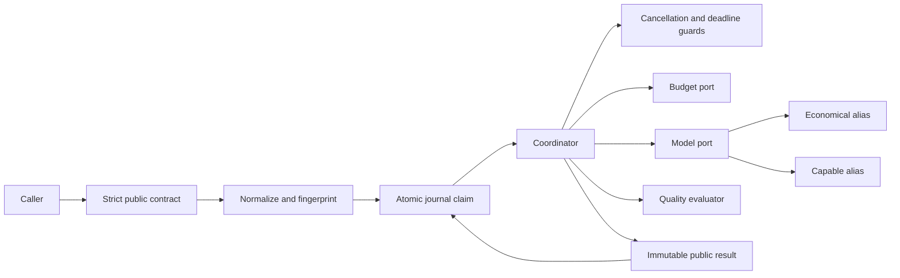

## Overview

TokenNexus-AI-Framework is a provider-neutral economics control plane for governed AI
requests. It selects an economical model first, evaluates the result, and permits one
capable-model escalation when quality, budget, cancellation, and deadline policy allow
it. Deterministic policy code owns every routing and terminal-state decision.

The current repository implements the synchronous orchestration core as a Python
library with a dependency-free local HTTP host. It includes strict public contracts,
request fingerprinting, atomic in-memory idempotency, immutable state transitions,
deterministic model and quality adapters, and safe public errors. It does not include
a production HTTP host or live model provider.

## Architecture



The design follows ports and adapters. Domain contracts and orchestration policy do
not depend on a cloud SDK, transport, database, or model vendor. A composition root can
replace each protocol implementation without moving policy into infrastructure code.

### Component Map

| Module | Responsibility |
| --- | --- |
| `contracts.py` | Frozen Pydantic request, result, usage, money, quality, and RFC 9457 contracts |
| `coordinator.py` | Admission, guards, reservations, dispatch, retry, quality evaluation, escalation, and terminalization |
| `fingerprint.py` | Request normalization, RFC 8785 canonical JSON, and SHA-256 fingerprints |
| `journal.py` | Atomic scoped idempotency claims, compare-and-set updates, and first-terminal-wins commits |
| `state.py` | Immutable run and attempt state with guarded transition functions |
| `ports.py` | Protocols for budgets, models, quality, cancellation, clocks, and identifiers |
| `adapters.py` | Scripted deterministic model and quality substitutes for local execution and tests |
| `reasons.py` | Closed public status and reason-code registry with compatibility validation |
| `problem_details.py` | Safe conversion from validation and domain errors to RFC 9457 problem details |
| `ids.py` | UUIDv7 identifier generation |
| `local_app.py` | Dependency-free local HTTP host and deterministic composition root |

### Request Lifecycle

1. `PublicRequest` validates schema version `1.0.0`, rejects unknown fields, and
   applies deterministic defaults.
2. `normalize_request` adds the authenticated scope and a UUIDv7 request identifier.
3. `request_fingerprint` hashes the normalized caller-controlled projection using RFC
   8785 canonical JSON and SHA-256.
4. `Journal.claim` atomically admits the scoped idempotency key, returns an existing
   run, or reports a fingerprint conflict.
5. `Coordinator` checks cancellation and the absolute monotonic deadline before
   controlled work.
6. The budget port reserves worst-case cost before each model dispatch or quality
   evaluation.
7. The economical alias executes first. One centralized transient retry may be used
   across the request.
8. The quality evaluator returns facts only. A below-threshold score can trigger one
   capable-model attempt when the remaining policy constraints permit it.
9. The coordinator creates a canonical UTC result and atomically commits the first
   terminal state. Later exact replays return that stored result.

### Core Contracts

All public models are strict, frozen Pydantic models with unknown fields forbidden.
The contract layer provides Draft 2020-12 JSON Schema output and enforces these wire
rules:

* UUIDv7 request and attempt identifiers
* Canonical UTC timestamps with millisecond precision
* Canonical decimal strings for money and quality scores
* ISO 4217 `USD` amounts without binary floating-point values
* Provider-neutral output, token usage, latency, and estimated cost
* Deterministically sorted, registered public reason codes
* Status-compatible result shapes that cannot mix output and error payloads

`PublicRequest` carries the application identity, idempotency key, task, mandatory
context, execution constraints, and cache directives. `PublicResult` exposes only the
safe status, output or error, and a decision summary. Provider diagnostics remain
outside the public contract.

### Governance Invariants

* An idempotency key is scoped by authenticated caller scope, not globally.
* Exact terminal replays perform no additional model or quality work.
* An active exact replay returns `in_progress`; changed content under the same key
  returns `conflict`.
* Every paid operation follows a successful reservation with a stable operation key.
* A request permits at most two model attempts and two quality evaluations.
* A request permits at most one capable-model escalation and one transient retry.
* Model and quality adapters report facts; they never choose routes or retry policy.
* Cancellation and deadline checks occur before controlled work.
* Late dependency results cannot overwrite a terminal run.
* Public failures use registered safe reason codes rather than provider details.

### How Token Savings Work

The implemented core reduces avoidable model work rather than truncating every prompt:

* Economical-first routing avoids a capable-model call when the first result meets the
  configured quality threshold.
* Scoped idempotency returns an existing terminal result without another model call,
  quality evaluation, or budget reservation.
* One escalation and one centralized transient retry bound the maximum amount of
  repeated model work.
* Input and output token ceilings travel with each normalized request so a production
  model adapter can enforce them at the provider boundary.

The result reports aggregate model usage in `decision_summary.usage`. Token savings
must be calculated against a defined baseline with the same request, model versions,
prices, and quality threshold. Routing to an economical model primarily reduces cost;
it does not guarantee fewer tokens because token counts depend on the actual provider
responses.

#### Reproducible Tested Example

The coordinator test fixture models a successful routine request with 10 input tokens,
5 output tokens, and an estimated cost of USD 0.01. The economical result passes its
quality check. Repeating the same request with the same scope and idempotency key
returns the stored result without new effects.

| Observed metric | Initial execution | Exact replay | Replay savings |
| --- | ---: | ---: | ---: |
| Model calls | 1 | 0 additional | 1 avoided |
| Quality evaluations | 1 | 0 additional | 1 avoided |
| Model input tokens | 10 | 0 additional | 10 avoided |
| Model output tokens | 5 | 0 additional | 5 avoided |
| Total model tokens | 15 | 0 additional | 15 avoided |
| Estimated model cost | USD 0.01 | USD 0 additional | USD 0.01 avoided |

For this duplicate-request scenario, the incremental token reduction is:

$$
\frac{15\ \text{baseline duplicate tokens} - 0\ \text{replay tokens}}
     {15\ \text{baseline duplicate tokens}} \times 100 = 100\%
$$

Run the evidence test directly:

```powershell
.venv-x64\Scripts\python.exe -m pytest tests/orchestration/test_coordinator.py::test_given_terminal_request_when_replayed_then_exact_result_has_no_new_effects -q
```

Observed result on 2026-09-16:

```text
1 passed
```

This is a deterministic local test result, not a production benchmark. The current
implementation does not yet include semantic caching, context compression, live
provider token accounting, or the 30-request all-capable baseline required for a
general savings claim.

### Status Model

Results use a closed set of statuses: `in_progress`, `completed`, `degraded`,
`quality_unmet`, `rejected`, `blocked`, `conflict`, `cancelled`, `timed_out`, and
`failed`. Each public reason code declares the statuses with which it is compatible.
Contract validation rejects an invalid status, output, error, or reason combination.

### Dependency Ports

`Coordinator` receives all external behavior through constructor-injected protocols:

* `Journal` for atomic persistence and replay
* `BudgetPort` for idempotent worst-case reservations
* `ModelPort` for one physical provider-neutral dispatch per call
* `QualityEvaluator` for scoring without policy authority
* `CancellationPort` for caller cancellation state
* `Clock` for monotonic deadlines and UTC result timestamps
* `IdSource` for UUIDv7 correlation identifiers

`SystemClock`, `Uuid7Source`, and `NeverCancelled` provide basic runtime defaults.
`InMemoryJournal`, `ScriptedModelPort`, and `ScriptedQualityEvaluator` provide
deterministic local substitutes. Script exhaustion fails explicitly, making unexpected
work visible in tests.

### Production Boundaries

The following integrations are intentionally outside the implemented core:

* Production HTTP authentication, authorization, and hosting
* Durable multi-process journal storage and crash recovery
* Live model SDK adapters and physical deployment alias resolution
* Production budget ledger and cancellation source
* Semantic cache lookup and storage
* Telemetry export and independent audit storage

A production journal must preserve atomic claim, compare-and-set, and
first-terminal-wins semantics. A live model adapter must disable hidden SDK retries or
surface each physical retry to the coordinator so budgets and attempt limits remain
enforceable.

## Repository Layout

| Path | Contents |
| --- | --- |
| `src/tokennexus/` | Public package, contracts, policy, ports, state, and adapters |
| `tests/contracts/` | Contract, fingerprint, reason, and problem-details tests |
| `tests/orchestration/` | Coordinator, replay, budget, retry, escalation, and adapter tests |
| `docs/architecture/` | Detailed architecture and developer guidance |
| `docs/brds/` | Business requirements |
| `docs/prds/` | Product requirements |
| `workshop/assets/` | Source requirements used during design |
| `test.py` | HTTP smoke client for the locally running application |

## Documentation

* [Technical Business Requirements Document](docs/brds/tokennexus-ai-framework-brd.md)
* [Product Requirements Document](docs/prds/tokennexus-ai-framework-prd.md)
* [Governed Request Orchestration](docs/architecture/governed-orchestration.md)

## Credentials

The current implementation uses deterministic, provider-neutral adapters and an
in-memory journal. It does not connect to Azure, Microsoft Foundry, or another model
provider, so no cloud credentials, API keys, or environment variables are required.

## Local Development

Install Python 3.11 and `uv`, then run these commands from the repository root in
PowerShell:

```powershell
py -3.11 -m venv .venv-x64
uv pip install --python .venv-x64\Scripts\python.exe --index-url https://packagefeedproxy.microsoft.io/pypi/simple/ -r requirements.txt
uv pip install --python .venv-x64\Scripts\python.exe --no-deps --no-build-isolation .
.venv-x64\Scripts\python.exe -m pytest -q
.venv-x64\Scripts\ruff.exe check src tests test.py
```

### Run the Local Application

Start the deterministic local HTTP application from the repository root:

```powershell
.venv-x64\Scripts\python.exe -m tokennexus.local_app
```

The server listens on `http://127.0.0.1:8000`. It exposes:

* `GET /health` for readiness checks
* `POST /v1/execute` for governed requests

The local host uses an in-memory journal and deterministic model and quality adapters.
It requires no credentials and does not call an external AI provider. Stop it with
`Ctrl+C`.

### Call the Application with the HTTP Client

Keep the server running and open a second PowerShell terminal in the repository root:

```powershell
.venv-x64\Scripts\python.exe test.py
```

The client checks `/health`, posts a strict request contract to `/v1/execute`, verifies
that the result is `completed`, and prints the JSON response. To use a different port,
pass the same value to both commands:

```powershell
.venv-x64\Scripts\python.exe -m tokennexus.local_app --port 8080
.venv-x64\Scripts\python.exe test.py --port 8080
```

## Mermaid Preview Errors

The message `No diagram type detected` means plain text was sent to a Mermaid renderer.
The question "What credentials and environment setup do I need, and how do I run this
locally?" is not Mermaid syntax. Open the README as Markdown, or submit that question
to chat instead of the Mermaid preview command.

Only fenced blocks beginning with a Mermaid diagram declaration should be sent to the
Mermaid preview command.
